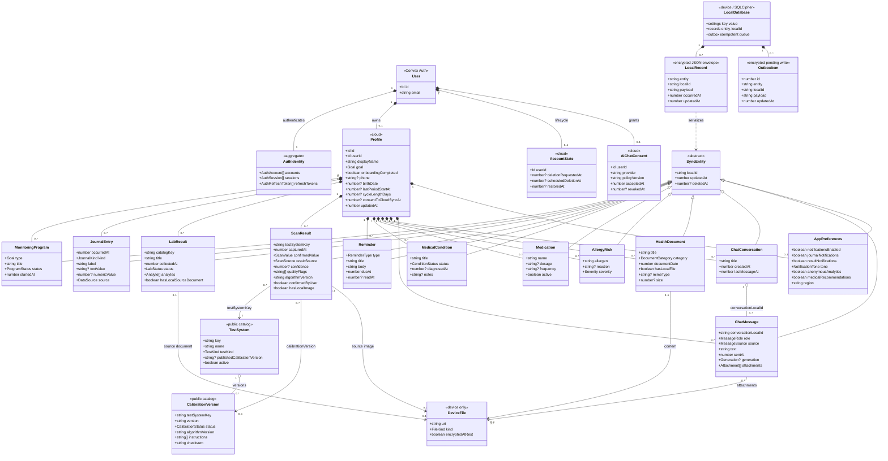

# Логическая структура данных ArtificialLabs

Диаграмма показывает доменную модель в ООП-представлении. Облачные сущности
соответствуют `convex/schema.ts`; локальное хранилище показывает физическую
модель SQLCipher и outbox на мобильном устройстве.

## Правила хранения

- `Profile` является корнем агрегата медицинских данных; серверные операции
  дополнительно проверяют владельца через `userId`.
- Все синхронизируемые сущности наследуют логические поля `localId`,
  `updatedAt`, `deletedAt`. `deletedAt` передаёт tombstone между устройствами.
- На устройстве сущности хранятся как типизированный JSON внутри общей таблицы
  `records`; `outbox` содержит последнюю неподтверждённую версию каждой записи.
- URI, фотографии тест-полосок, документы и вложения чата остаются в
  `DeviceFile`. В Convex уходят только структурированные значения и признаки
  наличия локального файла.
