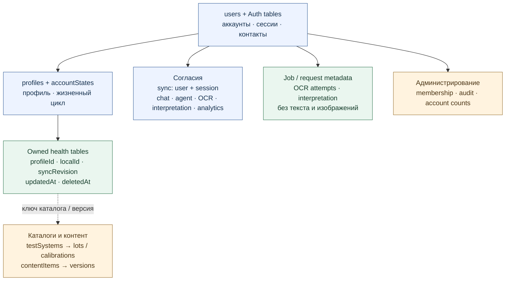

# Модель данных: Convex, устройство и временная обработка

Проверено 2026-09-13 по `main` `2837cda34bc06c8adf0251c11bbad0bf203af824`.
Источники: [Convex schema](../../convex/schema.ts),
[SQLCipher schema](../../lib/local-database.native.ts).
Схема укрупняет группы таблиц: это не SQL DDL и не обещание foreign-key
каскадов. Принадлежность проверяется сервером: `profiles.userId` указывает
на владельца, медицинские записи связаны с профилем через `profileId`.

## Логические связи

### Постоянные серверные данные

| Группа | Реальные таблицы | Связи и ограничения |
| --- | --- | --- |
| Auth | `users`, `authAccounts`, `authSessions`, `authRefreshTokens` и остальные `authTables` | Связи управляются Auth; секреты не входят в admin directory |
| Контакты / recovery | `contactVerificationChallenges`, `contactVerificationAttempts`, `emailChangeChallenges`, `emailChangeAttempts`, `passwordRecoveryChallenges`, `passwordRecoverySendAttempts`, `passwordRecoveryCodeFailures` | Ограниченные по времени challenge/attempts |
| Жизненный цикл | `profiles`, `accountStates` | userId; deletionRequestedAt / scheduledDeletionAt / restoredAt; не универсальное поле account.status |
| Review exemptions | `reviewLoginExceptions`, `reviewLoginAudit` | userId + актуальный email; active, store; аудит |
| Облако | `cloudSyncSessions` | userId + sessionId; consentedAt / revokedAt. Profile.consentToCloudSyncAt — legacy metadata |
| AI-согласия | `aiChatConsents`, `aiAgentConsents`, `documentOcrConsents`, `documentInterpretationConsents` | userId, policyVersion, отзыв; agent scopes; chat userEnabled отдельно от receipt |
| OCR / interpretation | `documentOcrJobs`, `documentInterpretationRequests` | userId + jobId/requestId, время, страницы/attempts/status. Нет OCR text/bytes |
| Медицинские записи | `monitoringPrograms`, `journalEntries`, `labResults`, `scanResults`, `reminders`, `medicalConditions`, `medications`, `allergyRisks`, `documents` | profileId → profiles.userId, переносимый localId и syncState; локальные URI исключены |
| Диалоги / настройки | `chatConversations`, `chatMessages`, `preferences` | conversationLocalId связывает сообщения; client settings не равны cloud preferences |
| План / агент | `carePlanItems`, `agentTriggers`, `recommendationEvents`, `agentRuns` | Происхождение и политика; immutable-правила не отменяются выбором конфликта |
| SMS / доставка | `smsSendAttempts`, `smsDeliveryHints`, `smsDailyAggregates`, `smsTariffBalance`, `resendUsage` | HMAC buckets, короткоживущие hints, безопасные агрегаты; не raw SMS archive |
| Каталог | `testSystems`, `testLots`, `calibrationVersions`, `calibrationValidations` | testSystemKey/version/lot; таблица не доказывает наличие валидаций |
| Админка | `adminMemberships`, `adminAuditEvents`, `adminAssets`, `adminAccountLedger`, `adminAccountCounts`, `adminAccountMigration` | requireAdmin; cursor migration и идемпотентный учёт аккаунтов |
| Контент | `contentItems`, `contentVersions` | Публикуемые версии отделены от редактирования |
| Аналитика / мониторинг | `analyticsConsents`, `telemetryEvents`, `analyticsBuckets`, `analyticsDailyActiveKeys`, `analyticsDailyActiveCounts`, `analyticsWorkerState`, `serviceChecks` | Агрегаты; события/DAU не равны числу аккаунтов |

Сервер хранит медицинские данные при разрешённой синхронизации, но
административный directory их не возвращает. Его допустимые поля:
account ID, email, регистрация, вычисленный статус; не profile и не токены.

## Физическое хранилище устройства

| Объект SQLCipher | Ключ / содержание | Синхронизация |
| --- | --- | --- |
| `settings` | key/value; owner, профиль, receipts, `profileSyncBase.v1`, `syncConflictBackup.v1:*`, `updateChatDraft.v1` | Не отправляется целиком; профиль проходит отдельный portable-контракт |
| `records` | PK `(entity, local_id)`; JSON payload, occurred_at, updated_at | Только разрешённая структурированная часть |
| `outbox` | id, entity, local_id, payload, updated_at; unique entity/local_id | Последняя ожидающая версия; ACK точного отправленного payload |
| `document_extractions` | document_local_id → extraction JSON | **Не** snapshot/outbox/FTS |
| `telemetry_outbox` | event_id, payload, occurred_at, attempts | Отдельный согласованный transport, не health batch |
| `agent_search_fts` | entity, local_id, occurred_at, text | Локальный производный индекс |

SQLCipher-ключ в SecureStore с `WHEN_UNLOCKED_THIS_DEVICE_ONLY`.
Таблицы создаются `CREATE TABLE IF NOT EXISTS`, FTS имеет версию индекса.
Это не означает автоматической миграции всех будущих схем. Смена владельца
и удаление локальных данных очищают черновики, merge base и конфликтные копии.
JSON envelopes не следует изображать отдельной SQL-таблицей для каждого типа.

### Файлы и временная обработка

- Исходный PDF/JPEG/PNG, фото скана и вложения — app document storage.
  Их пути не передаются как поля Convex. Шифрование БД само по себе не
  доказывает отдельное прикладное шифрование каждого файла.
- `labResults.sourceDocumentLocalId` связывает результат с документом;
  `documents.hasLocalFile` не предоставляет файл другому устройству.
  Связь по localId не заменяет проверку наличия файла.
- Extraction draft содержит состояние, версию движка, страницы/текст,
  редактируемые показатели и подтверждение. Непроверенный OCR — не
  лабораторный факт. Подтверждение обновляет результат локально без копии
  исходника; outbox получает только разрешённые значения.
- Облачный OCR временно передаёт подготовленную страницу через HTTP action
  провайдеру. `documentOcrJobs` хранит метаданные, не результат OCR.
- Интерпретация отправляет выбранный текст и requestId после отдельного
  согласия; `documentInterpretationRequests` не хранит текст/ответ.
  Временная обработка и provider retention — разные свойства.

## Ревизии и конфликты

`syncState`: localId, необязательный syncRevision, updatedAt, deletedAt.
profileId задан медицинскими таблицами, userId — профилем и служебными
сущностями. Отсутствующая ревизия старых записей — 0,
не версия клиентского протокола. Протокол — отдельный аргумент запроса из
[shared/client-compatibility.ts](../../shared/client-compatibility.ts).

Новый health protocol проверяет ревизию, retry того же изменения идемпотентен.
Профиль использует portable merge base и трёхстороннее сравнение, а не
несуществующее profiles.syncRevision. Принятые legacy-записи продвигают
ревизию, но остаются на timestamp-политике разрешения конкурирующих правок.

Серверной таблицы `sync_conflicts` нет. Конфликт — ответ API и локальное
состояние просмотра. Перед выбором проверяются актуальные версии; предыдущая
локальная версия остаётся зашифрованно в settings вне outbox/FTS. Очередь
не очищается из-за ошибки, нового протокола или конфликтующего snapshot.
Подробнее: [multi-device sync](../multi-device-sync.md).

## Проверка

Сопоставлены имена таблиц/полей schema и CREATE TABLE native-кода.
Реальные пользовательские записи не запрашивались: это проверка структуры,
не наполненности БД. Runtime-флаги — в [сервисной архитектуре](service-architecture.md).
Редактируемая [draw.io-схема](diagrams/database-model.drawio).
