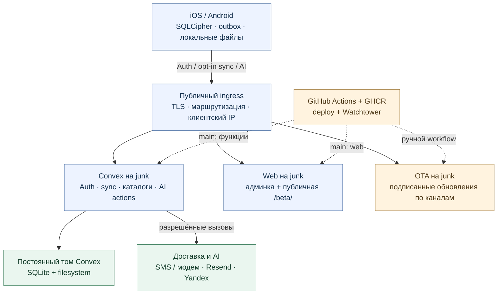

# Текущая сервисная архитектура «Сферы»

Проверено 2026-09-13 по актуальному `main`:
`2837cda34bc06c8adf0251c11bbad0bf203af824`.
Описание кода и отдельно обозначенных наблюдений развёртывания.
PostgreSQL/S3/GitLab вынесены в [целевую архитектуру](target-service-architecture.md),
трёхзональный k3s — в [отдельный проект](target-k3s-three-zones.md).

## Два абзаца для презентации

«Сфера» использует local-first-архитектуру: приложения iOS и Android сначала
сохраняют данные в зашифрованной SQLCipher и устойчивой исходящей очереди.
Облачная синхронизация включается отдельно для устройства; Convex проверяет
учётную запись, согласие сессии и владельца данных. Современный протокол
обнаруживает конкурирующие изменения, а пользователь явно выбирает версию
при конфликте. Недоступность сервера не отменяет завершённую локальную запись.

Серверные функции, защищённая админка, приватный SMS-шлюз и сервис обновлений
развёрнуты на отдельном узле; публичный ingress отделён от прикладных сервисов.
Email доставляется через Resend, ИИ — через отдельные вызовы провайдера с
проверками доступа и согласий. Это даёт управляемые границы данных и выпуска,
но не является подтверждённой мультизональной HA: основной backend сейчас
одиночный, а отказоустойчивое размещение в k3s остаётся отдельной целью.

## Простая схема — восемь блоков



## Инфраструктура и границы доверия

| Контур | Компоненты | Граница |
| --- | --- | --- |
| Устройство | Expo native, SQLCipher, SecureStore, StripCV, файлы, локальные уведомления | Ключ БД не синхронизируется; локальные URI исключены из health batch |
| Публичный вход | Nginx Proxy Manager на Fred, приватный connector к junk; сохранённые старые ingress | TLS и доверенный IP устанавливает ingress, не поле запроса клиента |
| junk / Convex | backend API и HTTP actions, отдельный dashboard, том `/convex/data` | Auth/ownership/согласия проверяются сервером |
| junk / SMS | `sms-gateway`, приватное состояние шлюза, доступ к модему | У шлюза нет опубликованного host-порта; секрет не отдаётся клиенту |
| junk / web и OTA | nginx со статическим `admin/out`, Watchtower, OTA-сервис | Публичная установка отделена от административных маршрутов |
| Внешние системы | Resend, Yandex AI Studio; Expo Push → APNs/FCM при настройке | Отдельная передача для разрешённого назначения |

### Адреса

| Имя под `brainwaves.engineering` | Назначение |
| --- | --- |
| `sfera` | Установка `/beta/`; `/` временно перенаправляет туда |
| `admin.sfera` | Административная консоль |
| `api.sfera` | Convex API / WebSocket |
| `site.sfera` | Convex HTTP actions, **не страница QR** |
| `dashboard.sfera` | Техническая панель Convex |
| `updates.sfera` | OTA manifest/assets |

Новые домены и маршрут NPM → приватный Tailscale/Headscale connector отражают
ранее согласованную конфигурацию. В этой проверке повторно подтверждены
connector на junk и ответы установки, но не полный export DNS/NPM/ACL.
Старые адреса `artificiallabs-convex.bebra42.ru`,
`artificiallabs-convex-site.bebra42.ru`, `artificiallabs-updates.bebra42.ru`
по-прежнему записаны в workflows. Нельзя утверждать, что все клиенты уже
перешли на новые имена. Legacy ingress также входит в модель угроз.

### Read-only наблюдения 2026-09-13

- На junk запущены один backend, dashboard, приватный SMS gateway,
  web, отдельный Watchtower, OTA и Tailscale connector.
- Backend имеет том `/convex/data`; признаки `POSTGRES_URL`, `MYSQL_URL`
  и `S3_*` в окружении контейнера отсутствуют. Вместе с Compose это
  соответствует штатному SQLite/filesystem размещению, не PostgreSQL/S3.
  Содержимое БД не читалось.
- Web, backend и dashboard имеют host bindings на всех интерфейсах;
  OTA — на loopback. Firewall/ACL не аудировались: это не доказательство
  внешней доступности портов, но и не loopback-only конфигурация backend.
- Публичный `/` вернул `302` с `Location: /beta/`, `/beta/` — `200`.
  Наличие маршрута не доказывает версию развёрнутых функций.
- Реплики, зональное размещение и failover текущего backend не подтверждены.
  SLA, RTO/RPO и HA не заявляются.

## Подробная схема взаимодействий

Цветовые полосы отделяют Auth, sync, AI/OCR и OTA. Все клиентские серверные
вызовы проходят ingress; ради читаемости повторные прокси-переходы опущены.
«Resend / оператор» объединяет внешние направления, не означает контейнер.

```mermaid
sequenceDiagram
  participant U as Native / SQLCipher
  participant E as Ingress TLS
  participant C as Convex / Auth
  participant D as SQLite / volume
  participant S as SMS gateway / modem
  participant P as Resend / оператор
  participant A as Yandex AI
  participant O as OTA service
  rect rgb(238,244,255)
    Note over U,D: AUTH — подтверждение контакта / восстановление
    U->>E: Запрос кода выбранного канала
    E->>C: Auth + доверенный IP metadata
    C->>D: HMAC buckets / challenge / лимит
    alt SMS разрешён
      C->>S: Приватный подписанный запрос
      S->>P: Модем → оператор → SMS на телефон
    else Email разрешён
      C->>P: HTTPS Resend API → письмо
    end
    U->>C: Введённый код
    C->>D: Проверка / погашение challenge
  end
  rect rgb(235,247,239)
    Note over U,D: SYNC — согласие текущей сессии
    U->>U: Транзакция SQLCipher + outbox
    U->>C: Batch + protocol + revisions
    C->>D: Ownership / receipt / revision / запись
    C-->>U: ACK точной версии или конфликт
    U->>U: ACK только подтверждённого payload
  end
  rect rgb(255,245,225)
    Note over U,A: AI / OCR — отдельные согласия и флаги
    U->>C: Страница OCR или выбранный текст
    C->>D: Резерв request ID, метаданные
    C->>A: Ограниченный запрос провайдеру
    A-->>C: Результат обработки
    C-->>U: Результат для проверки
    U->>U: SQLCipher draft; ручное подтверждение
  end
  rect rgb(245,239,255)
    Note over U,O: OTA — отдельная доставка
    U->>O: Platform + runtime + channel
    O-->>U: Подписанный manifest и assets
    U->>U: Проверка подписи; сохранить черновики
  end
```

## SMS и доверенный IP

Convex Auth → приватный `sms-gateway` → модем → оператор → телефон.
Коды нужны для подтверждения телефона и восстановления пароля. Обычный
вход — email/пароль либо подтверждённый телефон/пароль; OTP-only вход
требует отдельного `SMS_LOGIN_ENABLED=1`.

SMS ограничены тремя попытками доставки на идентификатор и клиентский IP
в независимых скользящих окнах 24 часа. Email recovery — пятью. Это не
универсальный лимит всех email-операций: подтверждение и смена контакта
имеют собственные challenge/лимиты. Recovery использует шестизначный код;
остаток попыток не раскрывается. Неизвестный телефон отклоняется до вызова
шлюза; отказ по лимиту не должен отправлять сообщение.

`smsAuth.ts` нормализует `metadata.ip` и вычисляет HMAC для buckets.
Безопасность IP зависит от ingress: клиентские forwarded-заголовки должны
перезаписываться, прямые и legacy пути не должны обходить доверенную цепочку.
В этой задаче повторный IP-spoofing тест не выполнялся — это эксплуатационная
предпосылка, а не новое подтверждение защиты. Сырые IP, телефоны и OTP
не включаются в документы, диагностику, логи или административные ответы.

Формат SMS учитывает iOS domain-bound code и Android Retriever hash подписи
приложения. Шлюз хранит приватный архив входящих SMS и удаляет свои исходящие
сообщения после истечения OTP с grace period. Архив не копируется в Convex.
USSD остатка тарифа — ручная операция с cooldown, не часть health check/CI.

## Email, согласия и доступ к ИИ

Подтверждение email: `emailVerification.ts` → `emailChange.sendEmail`;
recovery: `passwordRecovery.ts`. Оба транспорта вызывают Resend API напрямую.
Отдельный email-контейнер в коде и просмотренном составе сервисов не обнаружен.
Resend credentials серверные. Review exemptions привязаны к конкретному
пользователю и актуальному email, а не к произвольному обходу Auth.

Облачное согласие связано с Auth-сессией в `cloudSyncSessions`. Вход сам
его не выдаёт; отзыв на одном устройстве не отзывает другие. Разрешённый
signup UX может применить версионированный локальный receipt после проверки
email, но не переносит его на recovery/старые аккаунты и не перекрывает отзыв.
Chat, агент, OCR, интерпретация и аналитика имеют отдельные согласия.
Profile.consentToCloudSyncAt — legacy metadata, не право сессии на данные.

| Механизм в main | Условия | Runtime в этой проверке |
| --- | --- | --- |
| SMS | `SMS_AUTH_ENABLED`; OTP login отдельно | Шлюз запущен; доставки/флаги не проверялись |
| Email verification | `EMAIL_VERIFICATION_REQUIRED`, review exemptions | Значение не читалось; исторический checkpoint в client-compatibility |
| Облачный OCR | `AI_DOCUMENT_OCR_ENABLED=1`, нужный `YANDEX_DOCUMENT_OCR_MODEL`, Auth, session sync, OCR consent | Код есть; включение не утверждается |
| Интерпретация | `AI_DOCUMENT_INTERPRETATION_ENABLED=1`, активный аккаунт, отдельное согласие | Код есть; включение не утверждается |
| Строгий sync protocol | `SYNC_PROTOCOL_REQUIRED=1` или `SYNC_LEGACY_COMPAT_ENABLED=0` | Флаги не читались заново и не менялись |
| Remote push | EAS project ID, APNs/FCM и токены | Credentials не проверялись; локальные уведомления самостоятельны |

OCR в main не следует описывать исключительно как Tesseract: есть HTTP
`/document-ocr/page` с временной передачей страницы в Yandex Qwen. Документ
и URI не идут в обычный sync/storage; страницы обрабатываются в памяти
серверного запроса, Convex хранит метаданные job/attempt. Это отдельная
передача изображения провайдеру, не «изображение никогда не покидает
устройство». Provider retention не выводится из отсутствия записи в Convex.
Локальный native-модуль и старые Tesseract-черновики в репозитории сохраняются.

Документы ограничены PDF/JPEG/PNG, 20 MiB и 20 страницами; страницы
обрабатываются последовательно, черновик требует ручной проверки.
OCR draft — SQLCipher вне snapshot/outbox/FTS. После проверки пользователь
сохраняет структурированные показатели. Интерпретация по отдельной кнопке
передаёт выбранный подтверждённый текст до 24 000 символов, policyVersion
и requestId. Reservation предотвращает повтор с тем же ID; ответ не меняет
диагноз/план автоматически. Проверка транскрипции не доказывает клиническую
точность. Сервер не может удостоверить физический факт ручной проверки.

## Несколько устройств и совместимость

Protocol 1 проверяет `syncRevision`; пропущенная миграционная ревизия — 0.
Профиль использует merge base: независимые поля объединяются, пересечение
правок вызывает конфликт. Удаление передаётся tombstone. Подписка не затирает
pending local changes. ACK удаляет только отправленный payload и атомарно
обновляет ревизию правки, появившейся во время запроса. Конфликт не ретраится
бесконечно; выбор версии явный, с повторной проверкой и локальной копией.

При разрешённой legacy-совместимости старые клиенты остаются на timestamp
политике с риском потери конкурирующих правок. Нельзя приписывать им защиту
protocol 1. `CLIENT_UPDATE_REQUIRED` задаёт feature/requiredProtocol, не
commit/build; блокируется конкретная операция, не локальная запись.
OTA check использует текущий канал, не переключает/перезапускает автоматически.
Старый клиент получает новый интерфейс только после обновления.
Подробнее: [sync](../multi-device-sync.md), [совместимость](../client-compatibility.md).

## Админка, установка и CI/CD

`admin/` — статический Next.js export под nginx. `/beta/` публична, без
Convex/Auth providers. `/` и `/kit` на административном хосте защищены;
серверные административные операции вызывают `requireAdmin()`.
Read-only directory допускает account ID/email/регистрацию/статус, без
медицинских профилей, чатов, файлов и токенов. Счётчики аккаунтов
материализованы; аккаунты, регистрации и дневная активность — разные метрики.
Сумма дневных уникальных пользователей не равна месячному MAU.

Push `main` запускает GitHub Actions: verify → Convex deploy → GHCR web image;
Watchtower обновляет разрешённый web-контейнер. Ручной web workflow также
меняет `latest`. Нет основания считать main «только staging»: он меняет
указанный self-hosted backend/web. Runtime image содержит export и nginx,
не исходники/секреты. Live E2E с привилегиями — отдельный ручной workflow.

OTA — только `workflow_dispatch` на main: экспорт Preview и продвижение
проверенных update ID без пересборки. Runtime fingerprint/platform/channel
изолируют релизы; подпись обязательна, native-код через OTA не добавляется.
Push main сам по себе OTA и магазинную публикацию не запускает.

## Источники и файлы схем

- [Compose](../../infra/convex/docker-compose.yml), [nginx](../../infra/web/nginx.conf), [Dockerfile](../../Dockerfile).
- [Web workflow](../../.github/workflows/ghcr-publish.yml), [OTA workflow](../../.github/workflows/ota.yml).
- [SQLCipher](../../lib/local-database.native.ts), [Convex schema](../../convex/schema.ts), [health](../../convex/health.ts), [profile](../../convex/profile.ts).
- [SMS](../../convex/smsAuth.ts), [лимиты](../../convex/lib/sms.ts), [шлюз](../../infra/convex/sms-gateway/server.mjs).
- [Email verification](../../convex/emailVerification.ts), [email transport](../../convex/emailChange.ts), [recovery](../../convex/passwordRecovery.ts).
- [OCR HTTP](../../convex/documentOcrHttp.ts), [OCR access](../../convex/documentOcr.ts), [интерпретация](../../convex/documentInterpretation.ts).
- [Простая draw.io](diagrams/current-simple.drawio), [подробная draw.io](diagrams/current-interactions.drawio).

Документ описывает проверенный commit, а не гарантирует, что каждый native
клиент или backend исполняет именно его. Live-флаги, полный ingress ACL,
provider retention и версия развёрнутых функций требуют отдельной проверки.
Медицинские записи, секреты и содержимое сообщений не извлекались.
