# Сервисная архитектура ArtificialLabs

Это целевая production-схема. Она сохраняет локальный SQLCipher на телефоне,
но заменяет **серверную** SQLite текущего self-hosted Convex на PostgreSQL.
S3-compatible storage используется самим Convex для модулей, snapshot/import,
экспортов и поисковых индексов; медицинские исходники в S3 не загружаются.
Исходный код, CI/CD, registry и build artifacts размещаются в self-hosted
GitLab. Web-клиент в целевую схему не входит.

```mermaid
flowchart LR
  subgraph NATIVE[Expo native clients · iOS / Android]
    UI[Expo Router screens\nпрофиль · журнал · анализы · скан · чат]
    PROVIDERS[React providers\nAuthSession · HealthStore · Connectivity\nNotificationManager]
    LOCAL[(SQLCipher SQLite\nsettings · records · outbox)]
    SECURE[Expo SecureStore\nDB key · auth session]
    FILES[Device document storage\nscan photos · documents · attachments]
    CV[StripCV native module\non-device recognition]
    LOCAL_PUSH[expo-notifications\nlocal schedules]

    UI --> PROVIDERS
    PROVIDERS -->|local write first| LOCAL
    PROVIDERS --> SECURE
    UI --> CV
    CV -->|structured result| PROVIDERS
    CV -->|source image| FILES
    PROVIDERS --> FILES
    PROVIDERS --> LOCAL_PUSH
  end

  subgraph EDGE[Public edge]
    TLS[frp-easy + TLS\nbackend · site · dashboard]
  end

  subgraph CONVEX[Self-hosted Convex]
    direction TB
    API[Reactive API / WebSocket\nqueries · mutations]
    HTTP[HTTP actions / site proxy]
    AUTH[Convex Auth\nemail + password]
    DOMAIN[Domain functions\nprofile · health sync · ownership]
    CHAT[Chat action\nconsent · rate limit · Yandex adapter]
    NOTIFY[Push component\ntoken registry · delivery]
    CRON[Cron\naccount purge after 30 days]
    DASH[Convex Dashboard\nadmin-only]

    API --> AUTH
    API --> DOMAIN
    API --> CHAT
    API --> NOTIFY
    HTTP --> CHAT
    CRON --> DOMAIN
  end

  subgraph DATA[Server data plane · target]
    PG[(PostgreSQL\nConvex transactional state)]
    S3[(S3-compatible object storage\nmodules · snapshots · imports\nexports · search indexes)]
  end

  subgraph EXTERNAL[External services]
    YANDEX[Yandex AI Studio\nLLM responses]
    EXPO_PUSH[Expo Push Service]
    APNS[APNs]
    FCM[FCM]
  end

  subgraph DELIVERY[Self-hosted GitLab delivery plane]
    GITLAB[GitLab instance\nsource control · merge requests]
    PIPELINE[GitLab CI pipelines\nverify · E2E · Convex deploy]
    RUNNER[Self-hosted GitLab Runner\nisolated protected jobs]
    REGISTRY[GitLab Container Registry\npinned infrastructure images]
    ARTIFACTS[Protected CI artifacts\nsigned APK / IPA]

    GITLAB --> PIPELINE
    PIPELINE --> RUNNER
    RUNNER --> REGISTRY
    RUNNER --> ARTIFACTS
  end

  PROVIDERS -->|Auth + opt-in sync\nstructured data only| TLS
  TLS --> API
  TLS --> HTTP
  TLS --> DASH
  API --> PG
  HTTP --> PG
  CRON --> PG
  API --> S3
  HTTP --> S3
  CHAT -->|after explicit AI consent| YANDEX
  NOTIFY --> EXPO_PUSH
  EXPO_PUSH --> APNS
  EXPO_PUSH --> FCM
  APNS --> NATIVE
  FCM --> NATIVE

  RUNNER -->|protected admin key| CONVEX
  REGISTRY -->|pinned backend / dashboard images| CONVEX
  ARTIFACTS -.->|install test or release build| NATIVE

  classDef client fill:#fff3f8,stroke:#d93d82,color:#4a2134,stroke-width:1.5px;
  classDef local fill:#fff9e8,stroke:#c79022,color:#4b3b16,stroke-width:1.5px;
  classDef backend fill:#eef4ff,stroke:#4777c7,color:#19345f,stroke-width:1.5px;
  classDef data fill:#eefaf3,stroke:#2d8a58,color:#173f2a,stroke-width:2px;
  classDef external fill:#f3efff,stroke:#7658b8,color:#302454,stroke-width:1.5px;
  classDef delivery fill:#f2f3f5,stroke:#69707a,color:#25282d,stroke-width:1.5px;

  class UI,PROVIDERS,CV,LOCAL_PUSH client;
  class LOCAL,SECURE,FILES local;
  class TLS,API,HTTP,AUTH,DOMAIN,CHAT,NOTIFY,CRON,DASH backend;
  class PG,S3 data;
  class YANDEX,EXPO_PUSH,APNS,FCM external;
  class GITLAB,PIPELINE,RUNNER,REGISTRY,ARTIFACTS delivery;
```

## Основные взаимодействия

1. Native-клиент сначала фиксирует изменение в SQLCipher и idempotent outbox.
2. Только после Auth и явного opt-in `HealthStore` отправляет структурированный
   batch через Convex; подтверждённые строки удаляются из outbox.
3. Convex проверяет владельца, исполняет бизнес-функции и хранит
   транзакционное состояние в PostgreSQL.
4. S3 является внутренним storage backend Convex. Исходные медицинские файлы и
   их URI не покидают устройство.
5. StripCV анализирует снимок локально; в облако поступают версия алгоритма,
   confidence, quality flags, signal ratio и подтверждённое пользователем
   значение.
6. Локальные уведомления не требуют сервера. Remote push проходит через
   Convex component → Expo Push Service → APNs/FCM и работает только при наличии
   EAS project ID и provider credentials.
7. Self-hosted GitLab хранит репозиторий и запускает pipelines на собственном
   GitLab Runner. Protected job публикует Convex-функции, registry хранит
   закреплённые infrastructure images, а подписанные APK/IPA остаются
   защищёнными CI artifacts.

## Текущий и целевой storage

| Слой                    | Сейчас                                        | Цель на схеме                   |
| ----------------------- | --------------------------------------------- | ------------------------------- |
| Устройство              | SQLCipher SQLite + SecureStore + device files | Без изменений                   |
| Convex transactional DB | SQLite в Docker volume `/convex/data`         | PostgreSQL через `POSTGRES_URL` |
| Convex object storage   | Локальный filesystem в Docker volume          | S3-compatible buckets           |
| Медицинские исходники   | Только на устройстве                          | Только на устройстве            |

Миграция server storage является отдельной инфраструктурной операцией:
snapshot export → новый Convex backend с PostgreSQL/S3 → snapshot import →
переключение endpoint после проверки. Она не выполняется созданием диаграммы.

Основание для целевой конфигурации: официальный self-hosted Convex поддерживает
[PostgreSQL](https://github.com/get-convex/convex-backend/tree/main/self-hosted)
и отдельный
[S3 storage backend](https://github.com/get-convex/convex-backend/blob/main/self-hosted/advanced/s3_storage.md).
