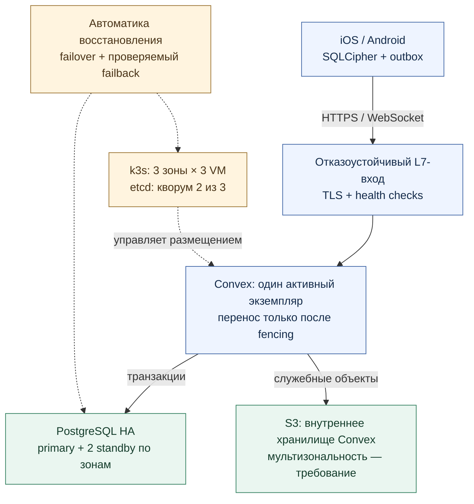
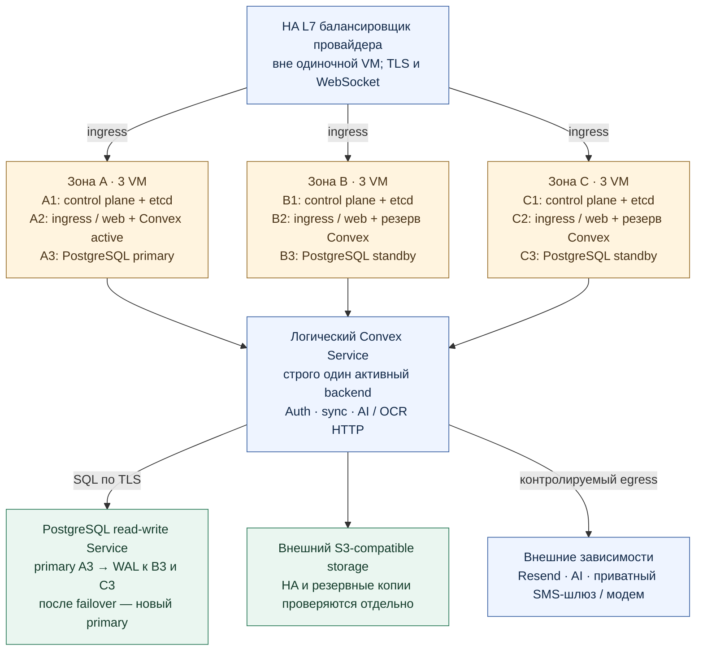

# Цель: «Сфера» на k3s в трёх зонах

Статус: **проект размещения, не описание работающего production**.
Дата: 2026-09-13. База приложения: `main`,
`2837cda34bc06c8adf0251c11bbad0bf203af824`.
Первоначальное допущение о существующем кластере в трёх независимых зонах
**не подтвердилось в отчёте DevOps от 2026-09-13, 12:29 MSK**: обнаружены
три самостоятельных K3s по три VM, все на трёх гипервизорах площадки Sasha.
Это не реализация схемы ниже. Роли VM и HA ниже — предлагаемая цель,
а не результат инвентаризации. Подтверждения и ограничения:
[инфраструктурный whitepaper](infrastructure-whitepaper.md).

## Коротко для презентации

Целевая архитектура «Сферы» предусматривает размещение в трёх зонах
доступности на девяти виртуальных машинах. Кворумный control plane k3s,
разнесённые точки входа и реплики PostgreSQL должны позволить восстанавливать
сервис при потере одной зоны. Приложение сохраняет local-first-модель:
завершённые локальные записи остаются в SQLCipher и ожидают синхронизации
в устойчивой очереди даже во время переключения серверов.

Восстановление проектируется как управляемый автоматический процесс:
обнаружение сбоя, изоляция прежнего активного узла, переключение и проверка
готовности. Вернувшаяся зона сначала догоняет данные и проходит период
стабилизации, затем возвращается в обслуживание. Это целевой механизм,
который предстоит подтвердить испытаниями; измеренные RTO/RPO, SLA и
непрерывная доступность Convex пока не заявляются.

## Простая схема

## Размещение: девять VM

На подробной схеме стрелки показывают маршрутизацию запросов.
Узлы A1/B1/C1 образуют один etcd-кластер с кворумом 2/3; межузловые линии
опущены, чтобы не смешивать control plane с прикладным трафиком.
Все три ingress направляют запросы в **один** активный Convex endpoint,
а не в три независимых пишущих backend. Primary в зоне A — только начальное
состояние примера, не постоянная привязка. S3, балансировщик и внешние
провайдеры не входят в девять VM и требуют отдельного бюджета/проверки.

## Почему не просто replicas: 3 для Convex

Официальный self-hosted Convex допускает внешний SQL и S3, но это само по
себе не подтверждает безопасную active-active-топологию из трёх backend
одной инстанции. Для этой схемы выбран консервативный проект: один активный
backend и автоматический запуск замены в доступной зоне **после доказанной
изоляции прежнего процесса**. Поддержку и детали такой эксплуатации нужно
проверить на закреплённой версии Convex до миграции.

`replicas: 1`, Lease, readiness и удаление Pod сами по себе не являются
fencing: изолированный от Kubernetes API процесс может продолжать работу.
Нужен подтверждаемый механизм провайдера — выключение VM либо отзыв её
доступа к хранилищам и внешним side effects. Без подтверждения изоляции
автоматика останавливается и требует оператора. Не форсировать удаление Pod
как замену fencing. Перезапуск включает восстановление backend и обрыв /
повторное подключение WebSocket; это не zero-downtime active-active.

## Условия HA и динамического возврата

| Слой | Предлагаемый механизм | Существенное условие |
| --- | --- | --- |
| Control plane | Три k3s server/etcd, по одному в зоне | Большинство 2/3; приватная связность, измеренные RTT и IOPS |
| Ingress/web | Реплики в трёх зонах, topology spread и health checks | Балансировщик сам не должен быть одиночной точкой отказа; запас мощности после потери зоны |
| Convex | Один active, перенос на свободный worker после fencing | Проверка восстановления SQL/S3, scheduler и side effects на выбранном образе |
| PostgreSQL | CloudNativePG, три инстанса, anti-affinity по зонам | Проверенная политика синхронной репликации, выбор кандидата и защита от split-brain |
| Object storage | Внешний S3 с подтверждённой зональной устойчивостью | S3 API не гарантирует HA; нужны сведения о репликации и проверка восстановления |
| Возврат зоны | Health gates, догон WAL, cooldown, возврат реплик/трафика | Отдельная автоматика; это не встроенная гарантия k3s |

Предлагаемая политика PostgreSQL: primary и минимум одно синхронное
подтверждение из другой зоны. При отсутствии подходящей реплики не
переходить молча к асинхронной записи. Это осознанный компромисс задержки
и доступности; фактические гарантии зависят от настройки и выбора кандидата.
Локальные SSD/PVC PostgreSQL обслуживаются репликацией БД, а не надеждой
перемонтировать зональный диск в другую зону. Backups/PITR нужны отдельно.

1. **Detect:** несколько неуспешных проверок, проверка кворума и различение
   сетевого разделения от остановки процесса; исключить flapping.
2. **Fence:** изолировать прежних активных писателей. Пока результат
   неоднозначен, не запускать второго Convex и не разрешать split-brain БД.
3. **Failover:** оператор БД выбирает безопасную реплику; после появления
   writable endpoint запускается/восстанавливается Convex, проверяется readiness.
4. **Resume:** ingress возвращает трафик; клиенты переподключаются и повторяют
   только допустимые операции. Outbox и конфликтные записи не очищаются.
5. **Failback:** восстановленная зона сначала становится резервной, догоняет
   WAL и проходит проверки. Stateless-трафик возвращается автоматически после
   cooldown. Если требуется вернуть primary/Convex именно в прежнюю зону,
   отдельный контроллер выполняет согласованный switchover по health/lag/load
   gates; непрошедшие проверки отменяют возврат. Принудительный возврат лидера
   только ради прежнего адреса не нужен. Этот контроллер ещё предстоит реализовать.

## Границы доверия и зависимости

- Публичны только разрешённые TLS endpoint. Kubernetes API, etcd,
  PostgreSQL, управление dashboard и секреты — в приватном административном
  контуре. NetworkPolicy должна поддерживаться выбранным CNI и проверяться.
- Auth/ownership, согласия и протоколы синхронизации остаются в Convex;
  кластер и версия native-сборки не заменяют эти проверки.
- Балансировщик перезаписывает клиентские IP-заголовки; приложение доверяет
  только известному ingress. Запрос напрямую к backend не должен обходить
  лимиты SMS/email. Лимитирующее состояние сохраняется при переключении.
- Resend и AI остаются внешними API. OCR-страницы передаются только в
  отдельно согласованном сценарии; S3 в схеме — не разрешение загружать архив
  пользовательских документов. SQLCipher, локальные файлы и outbox сохраняются.
- Существующий физический модем и его единственный канал связи не становятся
  HA от переноса Convex в k3s. Для HA SMS нужен отдельный согласованный резерв
  с защитой от повторной отправки; его здесь не изображаем внедрённым.
- Админка, `/beta/` и OTA могут размещаться на workers, но OTA требует общего
  долговечного хранилища артефактов/указателей каналов и проверки подписи.
  Нельзя масштабировать текущий OTA-сервис вслепую как stateless.
- GitLab — отдельная возможная миграция delivery plane. Эта схема не
  изменяет текущие GitHub Actions и не предполагает запуск девяти VM для CI.

## Приёмка до утверждения HA

Проверить фактические zone labels и независимость зон у провайдера, размеры
VM и оставшуюся ёмкость при потере любых трёх VM. Измерить межзональные RTT,
потери пакетов, задержку SQL и производительность etcd-дисков.

На изолированном стенде выполнить потерю каждой зоны, сетевое разделение,
зависание активной VM, отказ диска, недоступность S3 и отсутствие доступа к
API провайдера для fencing. Проверить единственность активного backend,
отсутствие повторных scheduler/внешних side effects, сохранение Auth,
согласий, outbox и конфликтов; реальную отправку SMS/email не использовать.
После восстановления проверить догон реплик, cooldown и отмену небезопасного
возврата. Отдельно восстановить backup/PITR. Зафиксировать измеренные RTO/RPO,
а не назначать их числами в презентации. Потеря двух зон, провайдера целиком
и внешних API этой топологией автоматически не покрывается.

## Источники и статус проверки

- Редактируемые копии схем: [простая](diagrams/target-k3s-simple.drawio),
  [размещение по зонам](diagrams/target-k3s-placement.drawio).
- [Convex self-hosted](https://github.com/get-convex/convex-backend/blob/main/self-hosted/README.md): варианты размещения; не доказательство active-active HA.
- [SQL backend](https://get-convex-convex-backend.mintlify.app/self-hosting/database-setup) и [S3](https://get-convex-convex-backend.mintlify.app/self-hosting/storage): внешние хранилища; учитывать задержку до БД.
- [k3s embedded etcd HA](https://docs.k3s.io/datastore/ha-embedded): нечётное число server-узлов и кворум.
- [CloudNativePG failover](https://cloudnative-pg.io/docs/1.28/failover/): выбор нового primary и компромиссы восстановления.
- [Kubernetes: force deletion StatefulSet](https://kubernetes.io/docs/tasks/run-application/force-delete-stateful-set-pod/): риск нарушения единственности при принудительном удалении.
- Текущий проект: [Compose](../../infra/convex/docker-compose.yml), [совместимость клиентов](../client-compatibility.md), [multi-device sync](../multi-device-sync.md). Они не являются манифестами этого k3s-проекта.

Внешние руководства просмотрены 2026-09-13. Доска FigJam, предоставленная
владельцем, не прочиталась через доступный web-доступ; её содержимое не
использовано как доказательство и в неё ничего не внесено. Серверы, DNS,
флаги, данные и CI/CD в этой задаче не изменяются.
