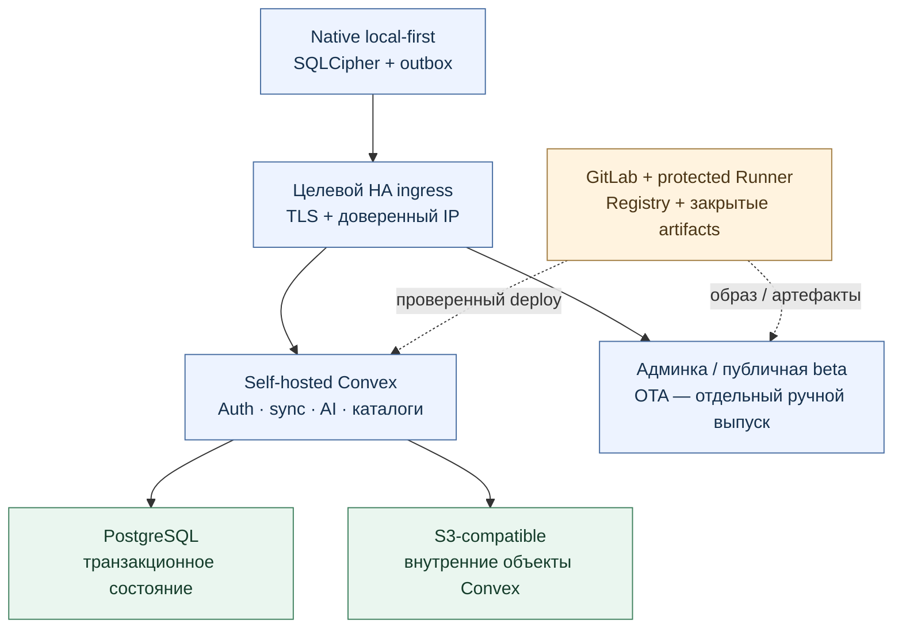

# Целевая сервисная архитектура — отдельно от текущей

Проект, не развёрнутая конфигурация. Дата 2026-09-13; база приложения
`main` `2837cda34bc06c8adf0251c11bbad0bf203af824`.
Ранее этот вариант занимал место описания текущей системы.
Текущая конфигурация: [service-architecture.md](service-architecture.md).

| Слой | Сейчас | Возможная цель |
| --- | --- | --- |
| Телефон | SQLCipher / SecureStore / файлы / outbox | Сохраняется local-first и явное согласие |
| Транзакции Convex | SQLite в Docker volume | PostgreSQL с проверенными backup/restore и HA |
| Служебные объекты | Filesystem volume | S3-compatible для модулей, экспортов, индексов, служебных объектов |
| Репозиторий / доставка | GitHub Actions + GHCR + Watchtower | Возможный GitLab + protected Runner + Registry |
| Размещение | Основной backend на junk | [Проект k3s: 3 зоны × 3 VM](target-k3s-three-zones.md) |

S3 не разрешает загружать пользовательский архив: обычный sync остаётся
структурированным. Облачная OCR-передача страниц и выбранный текст
интерпретации сохраняют собственные согласия. Resend/Yandex и SMS-шлюз
не исчезают при смене storage/CI. Админка и установка также сохраняются:
прежнее исключение всего web из цели не соответствует составу продукта.

## Условия реализации

1. Закрепить версии Convex/PostgreSQL/S3, проверить совместимость.
   Наличие POSTGRES_URL не доказывает безопасный active-active backend.
2. На изолированном стенде проверить export/restore состояния, служебных
   объектов, Auth, идемпотентность повторов и отложенных задач. План миграции
   должен согласовать остановку/догон новых записей и точку отката;
   простого import без защиты от новых записей недостаточно.
3. При переносе в GitLab перенести protected secrets, права Runner и правила
   выпуска. Не добавлять автоматическое OTA promotion вместе с переносом CI.
4. HA/мультизональность/failback утверждать после проверки реплик, независимых
   зон, кворума, fencing, backup restore и аварийных сценариев. Kubernetes,
   девять VM и S3 API сами по себе этих гарантий не дают.

Внешние хранилища описаны в официальном
[Convex self-hosted](https://github.com/get-convex/convex-backend/blob/main/self-hosted/README.md).
Это основание проектирования, не свидетельство миграции нашей системы.
Редактируемая [draw.io-схема](diagrams/target-services.drawio).
