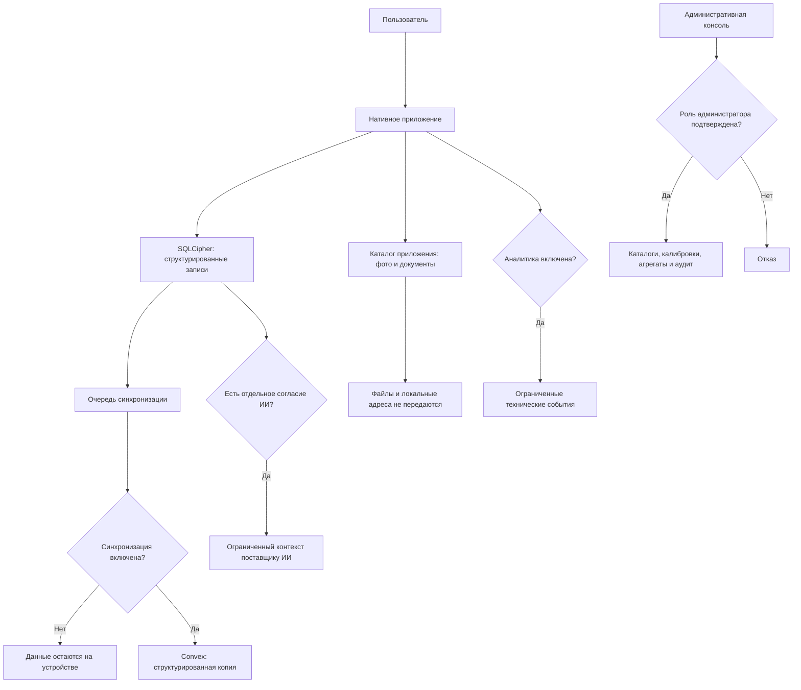

# Потоки данных и границы доверия

Медицинская запись сначала сохраняется в зашифрованной базе телефона. Фотографии тестов и исходные документы остаются на устройстве. Синхронизация, аналитика и ИИ — три независимых сетевых потока; включение одного не разрешает остальные.

## Где хранятся данные

| Место | Что там находится | Главная граница |
|---|---|---|
| SQLCipher на устройстве | Профиль, дневник, анализы, результаты сканирования, план, диалоги, настройки и очередь синхронизации. | Доступ зависит от ключа в SecureStore и действующей разблокированной сессии. |
| Каталог приложения | Фотографии тестов, документы и вложения. | Эти файлы не входят в облачную синхронизацию и требуют отдельной резервной копии. |
| Персональные таблицы Convex | Учётная запись и необязательная структурированная копия медицинских записей. | Сервер проверяет владельца, но согласие на синхронизацию пока проверяется не на всех путях чтения и записи. |
| Телеметрия Convex | Ограниченные технические события, суточные ключи и агрегаты. | Подробные события требуют согласия; суточный счётчик активности работает отдельно. |
| Поставщик ИИ | Видимый текст обычного диалога или ограниченный контекст помощника. | Нужны отдельное согласие и включённый серверный режим. |
| Поставщики уведомлений | Токен и нейтральный текст уведомления. | Отключение доставки не подтверждает физическое удаление токена. |
| Административная консоль | Каталоги, калибровки, опубликованные материалы, агрегаты и аудит. | Доступ к персональным медицинским таблицам не входит в её назначение. |

## Синхронизация

После включения на конкретном устройстве приложение сохраняет отметку согласия, обновляет профиль и начинает передавать очередь. Элемент удаляется из очереди только после ответа сервера. Локальные адреса и содержимое файлов из запроса исключаются.

Выключение сразу останавливает обмен на устройстве. Если сети нет, отзыв на сервере будет повторён позже. Ранее синхронизированные записи не удаляются: отзыв согласия, очистка устройства и удаление учётной записи — разные операции.

> [!warning] Неполная серверная граница
> Клиент проверяет согласие перед обменом, однако `health.syncBatch` и `health.snapshot` не требуют его для всех медицинских сущностей. До общей проверки на сервере эта мера считается частичной.

## Искусственный интеллект

Обычный диалог передаёт поставщику только ограниченную видимую переписку и не читает профиль. Расширенный помощник может получить профиль, недавние записи дневника, подтверждённые тесты, метаданные документов, историю диалогов и план. Локальные адреса, исходные файлы, контакты и внутренние идентификаторы исключаются.

Согласие связано с конкретным поставщиком и версией правил. Отзыв запрещает новые обращения, но сам по себе не подтверждает удаление данных, которые поставщик обработал раньше.

## Аналитика

Подробное техническое событие создаётся только после отдельного согласия. Оно может содержать платформу, версию приложения, версии алгоритма и калибровки, длительность и признаки качества. Фотография, медицинское значение, текст пользователя и постоянный идентификатор аккаунта в событие не входят.

Отдельно работает суточный агрегированный счётчик активных нативных клиентов. Он использует меняющийся HMAC-отпечаток и не содержит медицинских событий, но не управляется переключателем подробной аналитики.

## Административная и публичная части

Каждая административная операция на сервере вызывает `requireAdmin()`. Проверка роли в интерфейсе нужна для удобства, но не заменяет серверную авторизацию.

Публичные запросы возвращают только активные неперсональные калибровки и опубликованные материалы. Нативное применение удалённой подписанной калибровки пока не интегрировано и не считается пользовательской функцией.

## Правила для новых потоков

Перед выпуском нужно назвать источник данных, цель, состав полей, получателя, основание обработки, срок хранения и способ отзыва. Также требуется описать удаление, поведение без сети и безопасный сигнал для наблюдения.

Изменение одного поля может затронуть локальную схему, импорт, экспорт, синхронизацию, Convex, ИИ, аналитику, поддержку и документацию. Эти области проверяются вместе.

## Связанные материалы

- [[Пользователю/08-Приватность-и-безопасность|Конфиденциальность и безопасность]]
- [[Разработчику/04-Данные-и-синхронизация|Архитектура данных и синхронизации]]
- [[Разработчику/31-Классификация-данных|Классификация данных]]
- [[Разработчику/42-Хранение-и-удаление-данных|Хранение и удаление]]
- [[Разработчику/47-Происхождение-и-качество-данных|Происхождение и качество данных]]
- [[Разработчику/48-Согласия-и-цели-обработки|Согласия и цели обработки]]

---

← [[Общее/03-Матрица-функций-и-платформ|Функции по платформам]] · [[00-Стартовая-страница|Главная]] · [[Общее/05-Управление-документацией|Далее: управление документацией]] →
