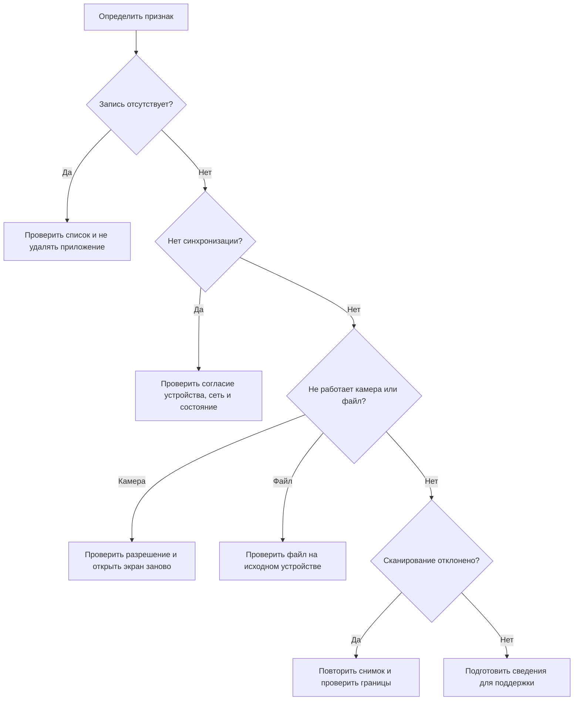

# Диагностика по признаку неисправности

Раздел помогает выбрать безопасные первичные действия без удаления данных и передачи лишних медицинских сведений.

> [!summary] Кратко
> При неисправности сначала сохраните состояние устройства: не переустанавливайте приложение, не очищайте данные и не создавайте дубликаты до проверки фактического результата операции.

## Когда прекратить самостоятельные действия

Не повторяйте операцию и подготовьте обращение, если отображаются чужие данные, исчезла подтверждённая локальная запись, раскрылся секрет или медицинский файл, либо приложение сформировало автоматический результат вопреки предупреждению о качестве. Такие признаки требуют эскалации, а не дополнительных попыток.

## Запись не появилась

1. Не удаляйте приложение и не очищайте его данные.
2. Вернитесь к списку и обновите экран.
3. Повторите сохранение один раз, только если записи действительно нет.
4. Зафиксируйте время, экран и последовательность действий.
5. Обратитесь в поддержку, если проблема повторяется.

## Запись есть, но не синхронизируется

Проверьте согласие на синхронизацию именно для текущего устройства, доступность сети и показанный класс ошибки. Не создавайте дубликаты: при временной сетевой или серверной ошибке исходящая очередь повторяет отправку самостоятельно. Ошибка аутентификации не повторяется как транспортная и требует нового входа.

## Камера не открывается

Откройте системные настройки приложения и разрешите камеру. Убедитесь, что она не занята другой программой, затем закройте экран сканирования и откройте его снова.

## Сканирование отклонено

Протрите объектив, используйте ровный контрастный фон, устраните блики и тени, снимите тест целиком и без сильного наклона. Подтверждайте значение только при соответствии наблюдаемому изображению.

## Исходный файл не найден

Проверьте, что используется то же устройство, на котором файл был добавлен, а приложение не переустанавливалось. Облачная синхронизация переносит структурированные сведения, но не исходные файлы.

## Не пришло уведомление

Проверьте разрешение, состояние напоминания, время, режимы энергосбережения и фокусировки. Удалённая доставка может быть не настроена; локальные напоминания работают независимо от неё.

## Сведения для поддержки

Допустимо передать модель устройства, версию системы и приложения, время события с часовым поясом, название экрана, ожидаемый и фактический результат, краткую последовательность действий, частоту повторения и обезличенный текст ошибки.

Не передавайте пароль, коды входа, токены, полный архив, медицинские документы и фотографии тестов через публичный канал. Используйте только официально предоставленный канал поддержки; текущий проект не задаёт его адрес.

## Связанные материалы

- [[Пользователю/10-Частые-вопросы-и-поддержка|Частые вопросы]]
- [[Пользователю/13-Статусы-и-сообщения|Статусы приложения]]
- [[Пользователю/08-Приватность-и-безопасность|Безопасность данных]]
- [[Разработчику/40-Поддержка-и-эскалация|Стандарт поддержки и эскалации]]

---

← [[Пользователю/13-Статусы-и-сообщения|Статусы и сообщения]] · [[Пользователю/00-Руководство-пользователя|Раздел]] · [[Пользователю/19-Анонимная-аналитика|Далее: Анонимная аналитика]] →
