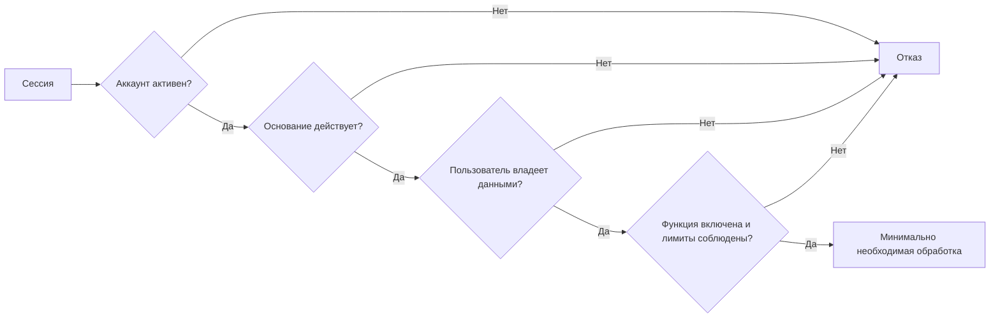

# Согласия и цели обработки

Аутентификация, разрешение операционной системы, согласие пользователя, административная роль и серверный переключатель решают разные задачи. Одно не заменяет другое.

Для каждого сетевого потока нужно отдельно назвать цель, данные, получателя и способ отзыва. Если обработка происходит на сервере, сервер сам проверяет действующее основание — доверять только интерфейсу нельзя.

## Как различать механизмы

- **Принятие документов** связывает пользователя с конкретной версией условий или политики.
- **Согласие** разрешает описанную цель обработки и определённый состав данных.
- **Настройка приложения** выражает желаемое поведение, но не всегда образует юридически значимое согласие.
- **Разрешение ОС** открывает камеру, медиатеку или уведомления; оно не разрешает сетевую передачу.
- **Серверный переключатель** включает техническую возможность. Пользователь им не управляет.
- **Роль администратора** даёт полномочие на служебную операцию, а не согласие субъекта данных.
- **Удаление аккаунта** запускает отдельный жизненный цикл и не равно отзыву всех согласий с мгновенным стиранием всех копий.

## Текущее состояние

| Область | Как включается и проверяется | Что происходит при выключении | Состояние |
|---|---|---|---|
| Регистрационные документы | Две галочки блокируют отправку формы на клиенте. Версия текста и серверное время не сохраняются. | Отдельного отзыва и истории нет. | Существенный пробел. |
| Облачная синхронизация | Устройство хранит `cloudSyncPreference.v1`, сервер — `consentToCloudSyncAt`. Клиент проверяет согласие перед обменом. | Клиент останавливается сразу; серверный отзыв может ждать сеть. Уже переданные записи остаются. | Серверная проверка неполна. |
| Подробная аналитика | Клиентская настройка и запись `analyticsConsents`; `telemetry.ingest` повторно проверяет состояние. | Очередь на устройстве очищается, новые события отклоняются, старые удаляются по сроку хранения. | Работает, но согласие не версионировано. |
| Суточная активность | Требует действующей сессии и использует суточный HMAC-отпечаток. | Переключатель подробной аналитики этот поток не отключает. | Отдельное основание не оформлено. |
| Обычный ИИ-диалог | Отдельная запись с поставщиком, версией правил и временем принятия. | Новые обращения запрещаются; история диалога остаётся. | Частично реализовано. |
| Расширенный помощник | Отдельное согласие сразу на шесть областей данных. Сервер проверяет поставщика, версию и полный набор областей. | Автоматизация выключается, незавершённые запуски удаляются, локальный план остаётся. | Частично реализовано. |
| Уведомления | Настройка приложения плюс разрешение ОС; удалённая доставка требует активного аккаунта и настроенных реквизитов. | Локальные задания удаляются. Остановка удалённой доставки не подтверждает удаление токена. | Настройка и разрешение ОС. |
| Административные операции | `adminMemberships` и обязательный вызов `requireAdmin()`. | Роль можно отозвать, кроме роли последнего администратора. | Полномочие, а не согласие. |

## Главные пробелы

### Регистрация

`components/AuthScreen.tsx` требует две галочки, но отправляет в Auth только адрес электронной почты, пароль и вид операции. Сервер не получает версию документа, локаль, время принятия или хеш показанного текста. В интерфейсе также осталось шаблонное наименование `ООО «Имя компании»`.

Такой интерфейс подтверждает только то, что пользователь поставил галочки в текущем сеансе. Он не создаёт воспроизводимую запись о принятии конкретной версии документов.

### Облачная синхронизация

`mayUseMedicalCloud()` запрещает обмен без локального согласия. Однако `health.syncBatch` проверяет `consentToCloudSyncAt` только для объектов плана и помощника, а `health.snapshot` вообще не проверяет эту отметку. Прямой серверный вызов для остальных медицинских сущностей закрыт не полностью.

Пока проверка не перенесена на все серверные пути чтения и записи, AL-CTRL-005 остаётся частичной мерой.

### Аналитика

Запись `analyticsConsents` содержит состояние и `updatedAt`, но не хранит версию правил, время первоначального принятия, цель и перечень полей. Суточный счётчик активности работает независимо от этой настройки. Оба решения должны быть явно отражены в пользовательском тексте и утверждены владельцами продукта и приватности.

### Искусственный интеллект

Обычный диалог и помощник используют разные согласия. Помощник принимает только полный набор `profile`, `journal`, `tests`, `documents`, `chats` и `care_plan`; выбрать отдельные категории нельзя.

Изменение поставщика, версии правил или состава `AI_AGENT_SCOPES` должно сделать прежнее согласие недействительным. Переменные `AI_CHAT_ENABLED`, `AI_AGENT_ENABLED` и `AI_AGENT_AUTOMATION_ENABLED` могут выключить функцию, но не могут разрешить её без согласия.

## Требования к новой обработке

До реализации нужно ответить на следующие вопросы:

1. Зачем обработка нужна пользователю или эксплуатации?
2. Какие поля, файлы и метаданные используются?
3. К какому классу AL-DATA относятся данные?
4. Кто получает данные: устройство, Convex, администратор, поставщик уведомлений или ИИ?
5. Что запускает обработку: действие пользователя, расписание или фоновое событие?
6. Где хранится версия текста и серверное время выбора?
7. Какая серверная функция запрещает вызов без основания?
8. Как отзыв работает без сети и как подтверждается серверное состояние?
9. Какие данные удаляются, остаются или истекают по TTL?
10. Как наблюдать отказ, не записывая чувствительную нагрузку?

Название экрана не считается целью. Если одна настройка открывает несколько получателей или способов обработки, их нужно перечислить отдельно.

## Порядок серверной проверки

Журнал может скрывать подробности ошибки от клиента, но должен различать отсутствие сессии, неактивный аккаунт, отсутствие основания, нарушение владения и техническое выключение. Медицинские значения в такой журнал не входят.

## Проверка согласия и отзыва

Минимальная приёмка включает:

1. отказ и закрытие диалога ничего не включают;
2. прямой серверный вызов без основания отклоняется;
3. устаревшая версия правил не принимается;
4. повторное принятие даёт предсказуемый результат;
5. отзыв блокирует запрос до обращения к внешнему поставщику;
6. без сети локальная функция закрывается сразу, а ожидание сервера видно пользователю;
7. другой пользователь не может прочитать или изменить запись;
8. изменение поставщика, локали, областей доступа и серверного переключателя проверяется отдельно;
9. удаление аккаунта обрабатывает записи согласий и документирует остатки;
10. журналы и результаты проверок не содержат медицинскую нагрузку.

## Поддержка

Для разбора жалобы достаточно вида цели, версии правил, времени принятия или отзыва, локального и серверного состояния, версии приложения, платформы и безопасного кода ошибки. Нельзя запрашивать пароль, токен, полный архив здоровья или исходный документ.

Случай передаётся безопасности, если обработка продолжается после подтверждённого отзыва, одна цель открывает другую без действия пользователя, согласие относится к чужому аккаунту или получателю ушли данные вне показанного состава.

## Источники реализации

- `components/AuthScreen.tsx`
- `lib/health-store.tsx`
- `lib/sync-policy.ts`
- `convex/profile.ts`
- `convex/health.ts`
- `convex/chat.ts`
- `convex/agent.ts`
- `convex/aiAgentConfig.ts`
- `convex/telemetry.ts`

## Связанные материалы

- [[Общее/04-Карта-данных-и-доверия|Потоки данных]]
- [[Пользователю/08-Приватность-и-безопасность|Конфиденциальность]]
- [[Пользователю/12-Разрешения-устройства|Разрешения устройства]]
- [[Разработчику/34-Телеметрия-и-аналитика|Телеметрия]]
- [[Разработчику/42-Хранение-и-удаление-данных|Хранение и удаление]]
- [[Разработчику/43-Безопасный-допуск-ИИ|Допуск ИИ]]

---

← [[Разработчику/47-Происхождение-и-качество-данных|Происхождение данных]] · [[Разработчику/00-Документация-разработчика|Раздел]] · [[Разработчику/01-Архитектура-приложения|Далее: архитектура]] →
